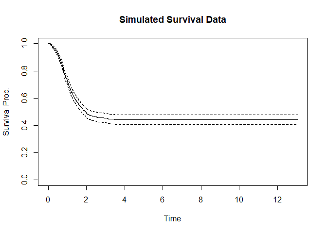

Overview
--------

The **REsmcure** package provides an extension to the CRAN-package
[smcure](https://github.com/cran/smcure) to fit Semi-Parametric (Cox
Proportional Hazards) Mixture Cure models with Bivariate Gaussian random
effects (one both the incidence and the latency part of the model). The
code allows for (and estimates) correlation of both random effects. The
model estimation is based on a paper by Lai & Yau (2008).

Content of the code
-------------------

-   simsomdata is a function that can be used to simulate some survival
    data with (correlated) random effects.

-   REsmsurv extends the smsurv function from the **smcure** package so
    it takes the presence of random effects into account. This function
    computes the baseline survival function for given data and (initial)
    parameter values. *for internal use*

-   REem implements the Expectation-Maximization (with Inner and Outer
    loop) for parameter estimation. The outer loop updates the fixed
    parameters, the BLUPs for the random effects and the baseline
    survival function, while the inner loop updates the parameters of
    the random effects’ distribution. *for internal use*

-   REsmcure is the wrapper function to estimate a mixture cure survival
    model with correlated random effects. The function allows different
    fixed effect models on the incidence (*cureform*) and the latency
    (*formula*). The random effect identifier is named (variable name as
    a string) using the RE argument.

-   sebootjack is a post-hoc function to add robust standard errors to
    the model object. Robust standard errors are obtained using either a
    parametric bootstrap procedure or a leave-k-out jackknife approach
    on the given dataset.

-   print.REsmcure is the printing function to obtain formatted model
    output.

How to use the code
-------------------

``` r
#devtools::install_github('HansTierens/MMixCure',dep=T)
library(MMixCure)
```

    ## Loading required package: arm

    ## Loading required package: MASS

    ## Loading required package: Matrix

    ## Loading required package: lme4

    ## 
    ## arm (Version 1.11-2, built: 2020-7-27)

    ## Working directory is C:/Users/hans.tierens/Desktop/MMixCure

    ## Loading required package: coxme

    ## Loading required package: survival

    ## Loading required package: bdsmatrix

    ## 
    ## Attaching package: 'bdsmatrix'

    ## The following object is masked from 'package:base':
    ## 
    ##     backsolve

    ## Loading required package: nloptr

    ## Loading required package: smcure

### Simulate some data

``` r
i=1234
n=1000
ng=10
coefficients<-list(gamma0 = c(0,.40,-.30,-.30,.25),  beta0 = c(0,.45,.35,-.25,-.15))
revcovmat<-list(varcure=1,  varfrail=1,  corr=-.8)

data<-simsomdata(i,n,ng,coefficients,revcovmat)
knitr::kable(data[1:10,])
```

|          Y|  Delta|          Xs|          Xd|   Ds|   Dd|  grp|
|----------:|------:|-----------:|-----------:|----:|----:|----:|
|  4.2651448|      0|  -0.5682069|  -0.7173020|    1|    0|    8|
|  1.7315386|      0|  -0.9269759|   0.2813380|    1|    1|    4|
|  1.2387607|      1|  -1.1357352|   0.0072819|    0|    1|    3|
|  1.0238482|      1|   0.9139623|  -1.7297002|    1|    0|    7|
|  1.5460203|      1|  -0.9860628|  -1.8434736|    0|    1|    9|
|  1.0152995|      0|   0.6674854|   0.6012030|    0|    1|    3|
|  0.6170677|      1|   1.4065955|  -2.3179376|    0|    1|    6|
|  1.3747303|      0|   1.1577790|  -0.3803121|    1|    0|    4|
|  5.5544436|      0|  -0.1387532|   1.6551649|    1|    1|    8|
|  0.4493318|      1|  -0.5393219|  -1.6628550|    1|    0|   10|

``` r
KMest<-survfit(coxph(Surv(Y,Delta)~1,data))
plot(KMest,main='Simulated Survival Data',ylab='Survival Prob.',xlab='Time')
```



### Fit the Model

``` r
coxfit<-coxph(Surv(Y,Delta)~1+Xs+Xd+Ds+Dd,data=data,ties='breslow')
summary(coxfit)
```

    ## Call:
    ## coxph(formula = Surv(Y, Delta) ~ 1 + Xs + Xd + Ds + Dd, data = data, 
    ##     ties = "breslow")
    ## 
    ##   n= 1000, number of events= 487 
    ## 
    ##        coef exp(coef) se(coef)      z Pr(>|z|)    
    ## Xs  0.38974   1.47660  0.04796  8.127 4.41e-16 ***
    ## Xd -0.12856   0.87936  0.04452 -2.887  0.00388 ** 
    ## Ds -0.12512   0.88239  0.09114 -1.373  0.16980    
    ## Dd  0.17463   1.19080  0.09105  1.918  0.05511 .  
    ## ---
    ## Signif. codes:  0 '***' 0.001 '**' 0.01 '*' 0.05 '.' 0.1 ' ' 1
    ## 
    ##    exp(coef) exp(-coef) lower .95 upper .95
    ## Xs    1.4766     0.6772    1.3441    1.6221
    ## Xd    0.8794     1.1372    0.8059    0.9595
    ## Ds    0.8824     1.1333    0.7380    1.0550
    ## Dd    1.1908     0.8398    0.9962    1.4234
    ## 
    ## Concordance= 0.621  (se = 0.013 )
    ## Likelihood ratio test= 79.88  on 4 df,   p=<2e-16
    ## Wald test            = 78.59  on 4 df,   p=3e-16
    ## Score (logrank) test = 78.83  on 4 df,   p=3e-16

``` r
frailtyfit<-coxph(Surv(Y,Delta)~1+Xs+Xd+Ds+Dd+frailty.gaussian(grp),data=data,ties='breslow')
summary(frailtyfit)
```

    ## Call:
    ## coxph(formula = Surv(Y, Delta) ~ 1 + Xs + Xd + Ds + Dd + frailty.gaussian(grp), 
    ##     data = data, ties = "breslow")
    ## 
    ##   n= 1000, number of events= 487 
    ## 
    ##                       coef    se(coef) se2     Chisq DF   p      
    ## Xs                     0.4193 0.04823  0.04816 75.56 1.00 3.5e-18
    ## Xd                    -0.1596 0.04552  0.04548 12.29 1.00 4.6e-04
    ## Ds                    -0.1392 0.09146  0.09142  2.32 1.00 1.3e-01
    ## Dd                     0.1494 0.09151  0.09147  2.66 1.00 1.0e-01
    ## frailty.gaussian(grp)                          66.61 8.75 5.3e-11
    ## 
    ##    exp(coef) exp(-coef) lower .95 upper .95
    ## Xs    1.5209     0.6575    1.3837    1.6716
    ## Xd    0.8525     1.1730    0.7798    0.9321
    ## Ds    0.8701     1.1493    0.7273    1.0409
    ## Dd    1.1611     0.8613    0.9704    1.3892
    ## 
    ## Iterations: 5 outer, 19 Newton-Raphson
    ##      Variance of random effect= 0.1908845 
    ## Degrees of freedom for terms= 1.0 1.0 1.0 1.0 8.7 
    ## Concordance= 0.663  (se = 0.663 )
    ## Likelihood ratio test= 164.2  on 12.74 df,   p=<2e-16

``` r
spmcfit<-smcure(Surv(Y,Delta)~1+Xs+Xd+Ds+Dd,cureform=~1+Xs+Xd+Ds+Dd,data=data,model='ph',link='logit',Var=TRUE)
```

    ## Program is running..be patient... done.
    ## Call:
    ## smcure(formula = Surv(Y, Delta) ~ 1 + Xs + Xd + Ds + Dd, cureform = ~1 + 
    ##     Xs + Xd + Ds + Dd, data = data, model = "ph", link = "logit", 
    ##     Var = TRUE)
    ## 
    ## Cure probability model:
    ##               Estimate  Std.Error    Z value     Pr(>|Z|)
    ## (Intercept)  0.1202928 0.10060440  1.1957012 2.318132e-01
    ## Xs           0.4336159 0.08453090  5.1296734 2.902453e-07
    ## Xd          -0.3534922 0.07526626 -4.6965557 2.645851e-06
    ## Ds          -0.1255649 0.15000875 -0.8370503 4.025643e-01
    ## Dd           0.3457475 0.14784144  2.3386375 1.935420e-02
    ## 
    ## 
    ## Failure time distribution model:
    ##       Estimate  Std.Error    Z value     Pr(>|Z|)
    ## Xs  0.37889702 0.05676623  6.6746904 2.477551e-11
    ## Xd  0.28256341 0.06350916  4.4491757 8.620049e-06
    ## Ds -0.06397680 0.10533577 -0.6073606 5.436116e-01
    ## Dd -0.07128201 0.10453556 -0.6818924 4.953070e-01

``` r
fit<-REsmcure(Surv(Y,Delta)~1+Xs+Xd+Ds+Dd,cureform=~1+Xs+Xd+Ds+Dd,RE='grp',rho=T, data=data, emmax = 50, eps = 1e-07) 
print.REsmcure(fit)
```

    ## 
    ##  Call:
    ## REsmcure(formula = Surv(Y, Delta) ~ 1 + Xs + Xd + Ds + Dd, cureform = ~1 + 
    ##     Xs + Xd + Ds + Dd, RE = "grp", rho = T, data = data, emmax = 50, 
    ##     eps = 1e-07)
    ## 
    ## Cure probability model:
    ##             Estimate Std.Error  Z value Pr(>|Z|)
    ## (Intercept) -0.20221   0.31341 -0.64520  0.51880
    ## Xs           0.49767   0.07662  6.49557  0.00000
    ## Xd          -0.39557   0.07124 -5.55293  0.00000
    ## Ds          -0.07165   0.14072 -0.50916  0.61064
    ## Dd           0.35477   0.14159  2.50559  0.01222
    ## 
    ## 
    ## Failure time distribution model:
    ##    Estimate Std.Error  Z value Pr(>|Z|)
    ## Xs  0.44277   0.05255  8.42629  0.00000
    ## Xd  0.33932   0.05041  6.73174  0.00000
    ## Ds -0.13984   0.09208 -1.51870  0.12884
    ## Dd -0.13665   0.09370 -1.45841  0.14473
    ## 
    ## Random Effects:
    ##                  Variance Correlation
    ## Cure/Incidence      0.830            
    ## Survival/Latency    0.782      -0.687

Citations and References
------------------------

-   This package builds on the **smcure** package, so please do refer
    to:

Cai, C., Zou, Y., Peng, Y., & Zhang, J. (2012). smcure: An R-package for
estimating semiparametric mixture cure models. *Computer Methods and
Programs in Biomedicine, 108*(3): 1255-1260.

-   For the implementation of the EM-algorithm, we build on previous
    work by:

Lai, X. & Yau, K. K. W. 2008. Long-term survivor model with bivariate
random effects: Applications to bone marrow transplant and carcinoma
study data. *Statistics in Medicine, 27*(27): 5692-5708.

and

Lai, X. & Yau, K. K. W. 2009. Multilevel Mixture Cure Models with Random
Effects. *Biometrical Journal, 51*(3): 456-466.

Lai, X. & Yau, K. K. W. 2010. Extending the long-term survivor mixture
model with random effects for clustered survival data. *Computational
Statistics and Data Analysis, 54*(9): 2103-2112.
